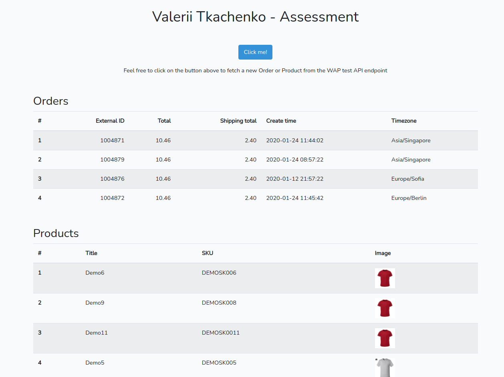

# WAP Development Assessment



## Installation

### Requirements

- [docker](https://docs.docker.com)
- [docker-compose](http://docs.docker.com/compose)


##### 1. Clone a project:
```bash
git clone https://github.com/valeriitkachenko/wap-dev-assessment.git
cd wap-dev-assessment/docker
```

##### 2. Run:

##### 2.1. Create environment files & up containers:
```bash
cp .env.example .env
docker-compose up -d workspace php-fpm nginx postgres
```

##### 2.2. Init an application
```bash
docker-compose exec -u laradock workspace bash

composer install
php artisan key:generate
```
Once done, provide your WAP_CLIENT_* credentials to Laravel's .env file

##### 2.3. Add a host (optional):

For Linux / MacOS:
```
sudo bash -c "echo 127.0.0.1 wap-assessment.local >> /etc/hosts"
```

For Windows: edit a file `%systemroot%\system32\drivers\etc\hosts` and add a line
```
127.0.0.1 wap-assessment.local
```

##### 3. Visit [wap-assessment.local](http://wap-assessment.local) or [127.0.0.1](http://127.0.0.1) 

##### DB dump
Please find a DB dump by the link:
[Database dump](storage/db.sql)
